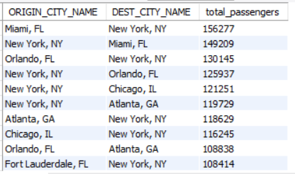
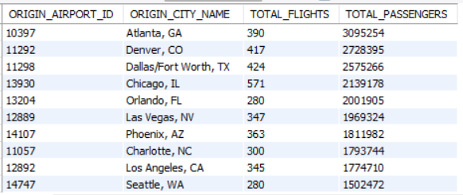
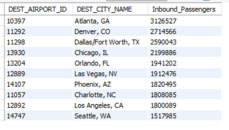
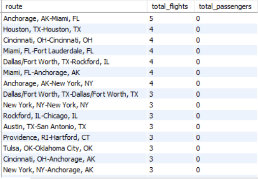
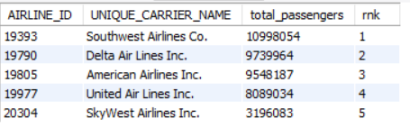

# Airport_analysis_project

Data analytics project showcasing Airport & Airline analysis using Python, SQL and Power BI

**1. Project Overview**

This project focuses on analyzing airport and airline data to uncover key insights related to flight operations, passenger trends, and overall performance. The dataset was explored using SQL, Python, and visualization tools to identify patterns and support data-driven decision-making.

**2. Dataset**

The dataset used in this project contains airport and airline related data used to analyze performance & patterns of airports and airlines.

Key characteristics of the dataset:

Contains multiple attributes related to airports and airlines

Includes categorical and numerical variables

Used for analysis, performance evaluation, and business insights

**3. Tools & Technologies**

The following tools and technologies were used throughout the project:

Python – Data loading, data cleaning, and exploratory data analysis

Pandas – Data manipulation 

MySQL Server – Querying the dataset and performing analytical SQL operations

Power BI- Data Visualisation

Gamma – Creating a presentation to communicate insights

Jupyter Notebook – Development environment for analysis

**4. Project Workflow / Steps**

**1. Data Loading**

Imported the dataset into Python using Pandas

Performed initial data inspection and structure analysis

**2. Exploratory Data Analysis (EDA)**

Examined distributions and patterns in the data

Identified trends, relationships, and anomalies

**3. Data Cleaning**

Handled missing values

Corrected inconsistent data entries

Checked for duplicates and irrelevant records

Checked after Standardized column formats

Python File: https://github.com/Praful51/Airport_analysis_project/blob/25a2956cca5944fa9ffb27f083d59ee9ed6c60b0/Airport_project.ipynb

**4. SQL Analysis**

Imported the cleaned dataset into MySQL Server

Performed SQL queries to answer analytical questions

Used aggregation, filtering, and grouping operations to derive insights

You can download and view the queries here:

SQLFile: https://github.com/Praful51/Airport_analysis_project/blob/bf5251b5418125a4f5e26bd75c32292658d805f3/AIRPORT_PROJECT.sql

**5. Reporting & Presentation**

Created a structured analytical report summarizing findings

Designed a presentation using Gamma to communicate insights effectively

Report: https://github.com/Praful51/Airport_analysis_project/blob/46cedfb1d539451854798e980f921ee0dc01d698/Airport%20Data%20Analysis%20Project%20Summary%20(1).pdf

**6. Presentation**

A presentation summarizing the analysis process, key insights, and business recommendations is included in this repository.

The presentation was created using Gamma and exported as a PDF for easy viewing.

It highlights:

The analytical approach used in the project

Key findings from the dataset

Business insights derived from the analysis

Final recommendations based on the results

You can download and view the presentation here:

Presentation: https://github.com/Praful51/Airport_analysis_project/blob/37114b961be75c004d3064a57ec387410ecc9a04/Airport-Data-Analysis-Using-SQL%20Presentation.pdf

**5. Key Insights:**

**1. Busiest routes**

   

- Certain routes carry significantly high passenger volumes compared to
others, indicating concentrated demand of travelling between specific
cities

**2. Top Performing Origin Airports**

 
   
- There are certain origin airports which are high performing
comparatively with high numbers of passengers & flights being handled
& departed from there

**3. Top Demanding Destination & Airports**

 

- We have certain high in demand destination cities & their airports with
high number of passengers arriving there

**4. Underutilised Routes**

 
   
- We have found certain routes between cities which are underutilised
where they have low passenger volume but have flight frequency, they
have got growth potential

**5. Top performing Airlines**

 
   
- There are specific airlines which are dominating and performing well
with having high passenger volumes with them compared to others

**6. Conclusion**

This project demonstrates a complete data analytics pipeline, transforming raw data into actionable insights using industry-standard tools. It highlights core analytical skills including data preparation, SQL analysis and data presentation.

**7. Author**

PRAFUL SINGH Aspiring Data Analyst

Skills: Python | SQL | Excel | Data Analysis
